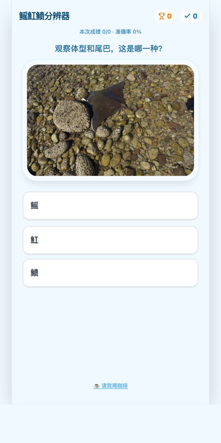

# 🐟 鳐魟鲼分辨大挑战

一个轻量、有趣的**海洋科普小游戏**：看图猜种类，帮你一秒学会区分外形相似的三类板鳃鱼——
**鳐（skate）、魟（stingray）、鲼（eagle ray）**。

> 在线体验：<https://ray.snownamida.top/>



## 🎯 项目目的

鳐、魟、鲼长得很像，常被笼统地叫作「魔鬼鱼」或「魟鱼」。
本项目用「看真实照片 → 三选一 → 即时科普卡片」的方式，
让你在游戏中记住它们在 **体型、尾巴、背鳍** 上的关键差异。

## 🕹️ 玩法

1. 打开页面，观察中间的照片（注意体型、尾巴和有没有背鳍/毒刺）。
2. 在下方三个按钮中选择你认为正确的种类：**鳐 / 魟 / 鲼**。
3. 答完后底部会弹出**科普卡片**，告诉你「为什么是它」。
4. 点击**下一题**继续挑战，连续答对会累积🔥连击。
5. 想炫耀成绩？点**晒战绩**一键分享；想支持作者？点 ☕ 请我喝咖啡。

## ✨ 功能特性

- 📸 真实照片题库，随机出题
- 🔥 连击计数 + 🏆 **历史最高连击**（本地保存，`localStorage`）
- 📊 本次会话得分与准确率实时显示
- 📖 每题结束后的**科普反馈卡片**（依据公开海洋生物资料整理）
- 🔗 **一键分享战绩**（支持系统分享 / 复制到剪贴板）
- 📱 移动端友好（响应式布局、大号触摸按钮、安全区适配）
- 🔎 SEO 优化（中文标题/描述、Open Graph、JSON-LD、可被搜索引擎索引的科普正文）
- ☕ 低调的赞助入口

## 🔬 三者速记

| | 鳐 Skate | 魟 Stingray | 鲼 Eagle Ray |
|---|---|---|---|
| 体型 | 菱形 / 心形 | 圆盘状 | 头身分界明显、有头鳍 |
| 尾巴 | 粗、多肉、**无毒刺** | 细长如鞭、**常带毒刺** | 细长，多带毒刺 |
| 背鳍 | 尾部有两个小背鳍 | 退化 / 缺失 | — |
| 习性 | 卵生，伏于海底 | 卵胎生，伏于海底 | 在水层中「飞行」 |

> 一句话：**粗尾两背鳍是鳐，鞭尾带毒刺是魟，长翅膀在水里飞的是鲼。**

## 🛠️ 技术栈

- `Vite` + `React 18` + `Tailwind CSS v4`，构建时预编译（此前为 Babel 浏览器内实时编译，首屏需下载约 3 MB 依赖；现产物约 50 KB gzip）
- 静态资源位于 `public/`（图片、音频），构建输出 `dist/`
- 托管于 Cloudflare Pages（构建命令 `npm run build`，输出目录 `dist`）

## 💻 本地运行

```bash
npm install
npm run dev      # 开发服务器
npm run build    # 生产构建 -> dist/
```

## 📄 媒体与版权

- **代码**：MIT License © Snownamida（见 [`LICENSE`](LICENSE)）。
- **图片（`images/`）与音频（`audio/`）**：来源于网络，仅用于科普与教学演示，
  **可能受各自原作者的版权保护**，其著作权归原作者所有，不在本项目 MIT 许可范围内。
  如你是某素材的权利人并希望署名或移除，请通过下方联系方式告知。

## 🙌 支持作者

如果这个小游戏帮到了你，欢迎请我喝杯咖啡：<https://ko-fi.com/snownamida>
